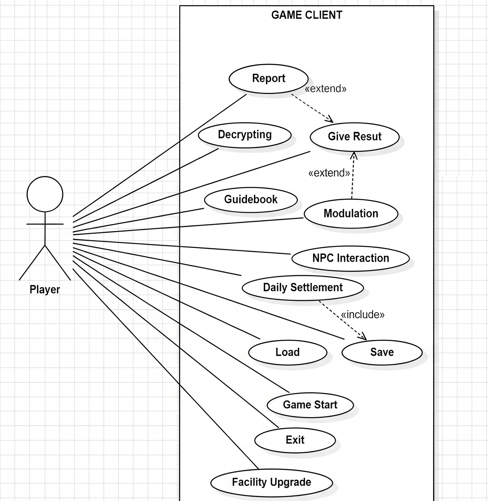

# 2. Use case analysis

## 1. Use case diagram

다음은 게임 시스템의 Use Case Diagram이다. 
NPC는 플레이어에게 의뢰를 제공하고 결과를 전달받는 역할의 게임 내부의 오브젝트에 가깝다고 판단하여 actor로 설정하지 않았다. 

플레이어는 게임을 시작하고 저장 및 불러오기를 수행할 수 있으며, NPC와의 상호작용을 통해 의뢰를 수락하고 암호문을 해독할 수 있다. 또한 플레이어는 해독 결과를 제출하거나 NPC를 신고할 수 있으며, 정산 결과를 바탕으로 시설 업그레이드를 진행할 수 있다.

게임의 주요 흐름은 NPC와의 상호작용을 통해 의뢰를 수락한 뒤, 가이드북을 참고하여 암호문을 해독하고 결과를 제출하는 방식으로 구성된다. 하루가 종료되면 일일 정산이 진행되며, 게임 진행 상황은 자동 저장된다.

Use Case Diagram에서는 Player를 주요 Actor로 사용하였으며, 일부 기능 간의 관계를 표현하기 위해 include 및 extend 관계를 사용하였다.

Daily Settlement는 하루 종료 후 자동 저장 기능을 수행하기 위해 Save를 include한다.
Modulation은 결과 제출 과정에서 선택적으로 수행되는 기능이므로 Give Result를 extend한다. 
Report는 결과 제출 대신 수행 가능한 기능이므로 Give Result를 extend한다.

## 2. Use case description
### Use case #1: Start Game (새 게임)
**1. GENERAL CHARACTERISTICS**

| 항목 | 내용 |
| :--- | :--- |
| **Summary** | 플레이어가 새로운 게임 데이터를 생성하여 첫 날(스테이지)을 시작하는 기능 |
| **Scope** | Project Crypto |
| **Level** | User Level |
| **Primary Actor** | Player |
| **Preconditions** | 게임이 실행되어 메인 타이틀 화면에 접속한 상태여야 한다. |
| **Trigger** | 플레이어가 메인 메뉴에서 '새 게임(New Game)' 버튼을 누를 때 |
| **Success Post Condition** | 새로운 세이브 데이터가 생성되고, 1일 차 스테이지 씬으로 이동한다. |
| **Failed Post Condition** | 시스템 오류로 데이터가 생성되지 않고 타이틀 화면에 머문다. |

**2. SCENARIOS**

| Step | Action |
| :--- | :--- |
| **S** | 플레이어가 게임을 처음부터 시작하려고 할 때 시작된다. |
| **1** | 플레이어가 '새 게임' 버튼을 클릭한다. |
| **2** | 시스템은 플레이어의 초기 자산과 평판 데이터를 기본값으로 설정한다. |
| **3** | 시스템은 1일 차 게임 씬을 로드하고 플레이어에게 제어권을 넘긴다. |

**3. RELATED INFORMATION**

| Performance | Frequency | Concurrency |
| :--- | :--- | :--- |
| < 5 Seconds | 플레이어가 새 게임을 시작할 때 | None |

---

### Use case #2: Save (저장)
**1. GENERAL CHARACTERISTICS**

| 항목 | 내용 |
| :--- | :--- |
| **Summary** | 현재까지 진행된 플레이어의 게임 상황(자금, 평판, 해독 기기 등)을 저장하는 기능 |
| **Scope** | Project Crypto |
| **Level** | User Level |
| **Primary Actor** | Player |
| **Preconditions** | 플레이어가 인게임 스테이지에 있거나, 일일 정산이 끝난 직후여야 한다. |
| **Trigger** | 하루가 종료되거나, 메뉴에서 수동 저장 버튼을 누를 때 |
| **Success Post Condition** | 현재 진행 데이터가 디스크에 성공적으로 보존된다. |
| **Failed Post Condition** | 용량 부족 등의 이유로 데이터가 저장되지 않는다. |

**2. SCENARIOS**

| Step | Action |
| :--- | :--- |
| **S** | 하루 일과가 끝나거나 플레이어가 게임을 저장하고 싶을 때 시작된다. |
| **1** | 일일 정산이 완료된 직후 시스템이 자동으로 저장을 요청하거나, 플레이어가 일시정지 메뉴에서 '저장'을 누른다. |
| **2** | 시스템은 현재 플레이어의 재화, 보유 기기, 날짜 정보를 파일로 저장한다. |
| **3** | 저장 완료 문구가 화면에 출력된다. |

| Step | Branching Action |
| :--- | :--- |
| **2a** | (Extension) 이미 존재하는 데이터 파일 위에 덮어씌우려 한다면 저장전 경고문구를 띄운다. |

**3. RELATED INFORMATION**

| Performance | Frequency | Concurrency |
| :--- | :--- | :--- |
| < 2 Seconds | 하루가 끝날 때마다, 또는 플레이어가 버튼을 클릭할 때 | None |

---

### Use case #3: Load (불러오기)
**1. GENERAL CHARACTERISTICS**

| 항목 | 내용 |
| :--- | :--- |
| **Summary** | 이전에 저장된 게임 데이터를 불러와 해당 시점부터 다시 플레이하는 기능 |
| **Scope** | Project Crypto |
| **Level** | User Level |
| **Primary Actor** | Player |
| **Preconditions** | 저장된 세이브 파일 데이터가 하나 이상 존재해야 한다. |
| **Trigger** | 타이틀 화면이나 일시정지 메뉴에서 '불러오기' 버튼을 누를 때 |
| **Success Post Condition** | 선택한 시점의 날짜, 자산, 평판 상태로 인게임 씬이 로드된다. |
| **Failed Post Condition** | 파일이 손상되어 데이터를 불러오지 못한다. |

**2. SCENARIOS**

| Step | Action |
| :--- | :--- |
| **S** | 플레이어가 이전 진행 상황을 이어서 플레이하고 싶을 때 시작된다. |
| **1** | 플레이어가 불러오기 메뉴를 열고 특정 세이브 슬롯을 선택한다. |
| **2** | 시스템은 해당 파일의 데이터를 통해 게임 상태를 복원한다. |
| **3** | 복원된 상태에 맞는 스테이지 씬으로 이동한다. |

| Step | Branching Action |
| :--- | :--- |
| **2a** | (Extension) 세이브 파일이 손상되었거나 호환되지 않는 경우   ...2a1. "파일을 불러올 수 없습니다"라는 에러 문구를 띄우고 타이틀 화면으로 되돌아 간다. |

**3. RELATED INFORMATION**

| Performance | Frequency | Concurrency |
| :--- | :--- | :--- |
| < 5 Seconds | 플레이어가 이어서 하기를 원할 때 | None |

---

### Use case #4: Exit (종료)
**1. GENERAL CHARACTERISTICS**

| 항목 | 내용 |
| :--- | :--- |
| **Summary** | 진행 중인 게임 클라이언트를 완전히 종료하는 기능 |
| **Scope** | Project Crypto |
| **Level** | User Level |
| **Primary Actor** | Player |
| **Preconditions** | 게임이 실행되어 있는 상태여야 한다. |
| **Trigger** | 메인 메뉴 또는 인게임 메뉴에서 '종료(Quit)' 버튼을 누를 때 |
| **Success Post Condition** | 게임 애플리케이션이 완전히 종료된다. |
| **Failed Post Condition** | 프로세스가 정상적으로 닫히지 않는다. |

**2. SCENARIOS**

| Step | Action |
| :--- | :--- |
| **S** | 플레이어가 게임 플레이를 마치고 끄려고 할 때 시작된다. |
| **1** | 메뉴에서 '게임 종료' 버튼을 클릭한다. |
| **2** | 시스템은 종료 전 저장하지 않은 진행 상황이 있는지 확인한다. |
| **3** | 시스템이 클라이언트 프로세스를 종료한다. |

| Step | Branching Action |
| :--- | :--- |
| **2a** | (Extension) 저장되지 않은 진행 상황이 있는 경우   ...2a1. "저장되지 않은 진행 상황이 사라집니다. 종료하시겠습니까?" 팝업을 띄운다. |

**3. RELATED INFORMATION**

| Performance | Frequency | Concurrency |
| :--- | :--- | :--- |
| < 2 Seconds | 플레이어가 게임을 마칠 때마다 | None |

---

### Use case #5: Receive Request (의뢰 접수)
**1. GENERAL CHARACTERISTICS**

| 항목 | 내용 |
| :--- | :--- |
| **Summary** | 상점을 방문한 NPC로부터 해독해야 할 암호문과 키(Key)를 전달받는 기능 |
| **Scope** | Project Crypto |
| **Level** | User Level |
| **Primary Actor** | Player, NPC |
| **Preconditions** | 하루 일과(스테이지)가 진행 중이며, 대기 중인 NPC가 상점에 입장해야 한다. |
| **Trigger** | NPC가 작업대 앞까지 다가와 상호작용을 시작할 때 |
| **Success Post Condition** | 작업대 위에 암호문과 키(Key) 아이템이 배치된다. |
| **Failed Post Condition** | 암호문과 키 아이템이 배치되지 않고 NPC가 퇴장한다. |

**2. SCENARIOS**

| Step | Action |
| :--- | :--- |
| **S** | 스테이지가 시작되고 NPC가 플레이어 앞에 도착했을 때 시작된다. |
| **1** | NPC가 의뢰 내용과 함께 암호문과 관련된 키(단어, 특정 소지품 등)를 작업대에 올려놓는다. |
| **2** | 시스템은 해당 서류와 아이템을 플레이어가 클릭(상호작용)할 수 있는 상태로 활성화한다. |

| Step | Branching Action |
| :--- | :--- |
| **1a** | (Extension) NPC가 암호 해독 의뢰가 아닌 다른 목적(스토리 이벤트)으로 방문한 경우   ...1a1. 암호문 대신 대화문이나 특정 퀘스트 아이템만 전달한다. |
| **2a** | (Extension) 플레이어가 의뢰를 거절한다면 NPC는 퇴장한다. |

**3. RELATED INFORMATION**

| Performance | Frequency | Concurrency |
| :--- | :--- | :--- |
| < 1 Second | 할당된 NPC 수만큼 반복 | None |

---

### Use case #6: Guidebook (가이드북) 
**1. GENERAL CHARACTERISTICS**

| 항목 | 내용 |
| :--- | :--- |
| **Summary** | 가이드북 UI를 열어 전달받은 키(Key) 형태에 맞는 해독 규칙을 찾는 기능 |
| **Scope** | Project Crypto |
| **Level** | User Level |
| **Primary Actor** | Player |
| **Preconditions** | 책상 위에 가이드북 오브젝트가 존재해야 한다. |
| **Trigger** | 플레이어가 책상 위의 가이드북 오브젝트를 클릭할 때 |
| **Success Post Condition** | 가이드북 UI가 팝업되며 원하는 암호 방식의 페이지를 확인할 수 있다. |
| **Failed Post Condition** | 가이드북 UI가 열리지 않는다. |

**2. SCENARIOS**

| Step | Action |
| :--- | :--- |
| **S** | NPC에게 암호문과 키를 받아 의뢰를 수락했을때 시작된다. |
| **1** | 플레이어가 작업대의 가이드북을 클릭한다. |
| **2** | 화면에 가이드북 UI가 팝업된다. |
| **3** | 마우스로 페이지를 넘기며 해독 규칙을 확인한다. |

**3. RELATED INFORMATION**

| Performance | Frequency | Concurrency |
| :--- | :--- | :--- |
| < 0.5 Seconds | 가이드북을 클릭했을 때 | None |

---

### Use case #7: Decrypting (해독)
**1. GENERAL CHARACTERISTICS**

| 항목 | 내용 |
| :--- | :--- |
| **Summary** | 해독 기기(오브젝트)를 조작하여 퍼즐을 풀고 암호문을 평문으로 변환하는 기능 |
| **Scope** | Project Crypto |
| **Level** | User Level |
| **Primary Actor** | Player |
| **Preconditions** | 플레이어가 암호문과 키 값을 확인하고 해독 기기를 보유한 상태여야 한다. |
| **Trigger** | 플레이어가 작업대 위의 해독 기기(암호 원판, 격자 등)를 클릭할 때 |
| **Success Post Condition** | 퍼즐 규칙에 맞게 기기를 조작하여 의미 있는 평문이 도출된다. |
| **Failed Post Condition** | 잘못된 조작으로 인해 해독에 실패하거나 무의미한 텍스트가 출력된다. |

**2. SCENARIOS**

| Step | Action |
| :--- | :--- |
| **S** | 가이드북을 통해 해독 방식을 파악하고 복호화를 시작하려 할 때 시작된다. |
| **1** | 플레이어가 암호 방식에 맞는 오브젝트를 클릭하여 팝업 UI를 연다. |
| **2** | 키 값에 맞춰 다이얼을 돌리거나 문자를 대입하는 등 퍼즐 조작을 수행한다. |
| **3** | 올바른 입력에 도달하면 암호문이 평문으로 변환되어 출력된다. |

**3. RELATED INFORMATION**

| Performance | Frequency | Concurrency |
| :--- | :--- | :--- |
| < 스테이지 종료 (미니게임) | NPC 의뢰 접수 시마다 | None |

---

### Use case #8: Give Result (평문 전달)
**1. GENERAL CHARACTERISTICS**

| 항목 | 내용 |
| :--- | :--- |
| **Summary** | 해독이 완료된 원본 평문 서류를 대기 중인 NPC에게 제출하여 거래를 마치는 기능 |
| **Scope** | Project Crypto |
| **Level** | User Level |
| **Primary Actor** | Player, NPC |
| **Preconditions** | 암호문이 평문 서류로 복호화되어 작업대 위에 존재해야 한다. |
| **Trigger** | 플레이어가 완성된 평문을 마우스로 드래그하여 NPC에게 건네주거나 확인 버튼을 누를 때 |
| **Success Post Condition** | 해당 의뢰가 종료되고, 다음 NPC가 오거나 하루가 종료된다. |
| **Failed Post Condition** | 평문 제출이 거부된다. |

**2. SCENARIOS**

| Step | Action |
| :--- | :--- |
| **S** | 플레이어가 해독을 정상적으로 마치고 결과를 넘겨주려 할 때 시작된다. |
| **1** | 플레이어가 완성된 평문 서류를 NPC 오브젝트 쪽에 드래그 앤 드롭 혹은 버튼을 클릭한다. |
| **2** | NPC가 결과물을 받고 상점을 떠난다. |
| **3** | 시스템은 해당 의뢰를 성공(정상 제출) 상태로 기록한다. |

| Step | Branching Action |
| :--- | :--- |
| **2a** | (Extension) 완전히 해독되지 않은 미완성/오답 서류를 넘긴 경우   ...2a1. NPC가 떠나고, 페널티가 적용된다. |

**3. RELATED INFORMATION**

| Performance | Frequency | Concurrency |
| :--- | :--- | :--- |
| < 2 Seconds | 각 의뢰의 마지막 단계 | None |

---

### Use case #9: Modulation (평문 변조)
**1. GENERAL CHARACTERISTICS**

| 항목 | 내용 |
| :--- | :--- |
| **Summary** | 해독된 평문의 일부 텍스트를 플레이어가 임의로 수정하여 거짓된 결과물을 만드는 기능 |
| **Scope** | Project Crypto |
| **Level** | User Level |
| **Primary Actor** | Player |
| **Preconditions** | 암호문이 평문으로 완전히 복호화되어 있어야 한다. |
| **Trigger** | UI내에서 변조 버튼을 클릭했을 때 |
| **Success Post Condition** | 원본 평문과 다른 내용이 평문에 적용되며, 변조된 상태로 제출된다. |
| **Failed Post Condition** | 텍스트가 수정되지 않는다. |

**2. SCENARIOS**

| Step | Action |
| :--- | :--- |
| **S** | 플레이어가 평문의 내용을 변조하려 할 때 시작된다. |
| **1** | 플레이어가 UI에 활성화된 변조 버튼을 클릭한다. |
| **2** | 평문이 임의의 내용으로 교체된다. |
| **3** | 변조된 평문을 NPC에게 전달한다. |

| Step | Branching Action |
| :--- | :--- |
| **3a** | (Extension) 변조 발각 이벤트 발생 시 일일정산에 변조로 인한 패널티를 부여한다. |

**3. RELATED INFORMATION**

| Performance | Frequency | Concurrency |
| :--- | :--- | :--- |
| < 1 Second | 플레이어의 전략적 선택에 따라 | None |

---

### Use case #10: Report (신고)
**1. GENERAL CHARACTERISTICS**

| 항목 | 내용 |
| :--- | :--- |
| **Summary** | 작업대의 오브젝트를 이용하여 의뢰인의 해독 결과를 당국이나 적대 세력에 밀고하는 기능 |
| **Scope** | Project Crypto |
| **Level** | User Level |
| **Primary Actor** | Player |
| **Preconditions** | 평문이 확보되었고, 해당 내용이 범죄나 기밀과 관련되어 있어야 한다. |
| **Trigger** | 플레이어가 평문을 전달하지 않고 책상 위의 오브젝트를 클릭하여 신고 버튼을 누를 때 |
| **Success Post Condition** | 경찰이 출동해 NPC를 연행하거나, 특정 팩션의 평판이 크게 상승/하락한다. |
| **Failed Post Condition** | 신고 대상이 아니거나 오브젝트가 비활성화되어 있다. |

**2. SCENARIOS**

| Step | Action |
| :--- | :--- |
| **S** | 해독된 내용이 위험하다고 판단하여 경찰에 신고하려 할때 시작한다. |
| **1** | 플레이어가 책상 위의 오브젝트를 클릭한다. |
| **2** | 평문을 경찰에 전송한다. |
| **3** | 오브젝트가 비활성화되고, 이벤트 연출(경찰 출동 등)과 함께 해당 의뢰가 강제 종료된다. |

**3. RELATED INFORMATION**

| Performance | Frequency | Concurrency |
| :--- | :--- | :--- |
| < 5 Seconds | 플레이어의 전략적 선택에 따라 | None |

---

### Use case #11: Daily Settlement (일일 정산)
**1. GENERAL CHARACTERISTICS**

| 항목 | 내용 |
| :--- | :--- |
| **Summary** | 하루 일과 종료 시 수입/지출/벌금/평판 변화를 일괄 계산하여 장부 형태로 보여주는 기능 |
| **Scope** | Project Crypto |
| **Level** | User Level |
| **Primary Actor** | Player |
| **Preconditions** | 스테이지(하루)에 할당된 시간이 다 되었을 때 |
| **Trigger** | 자동으로 발생 |
| **Success Post Condition** | 정산 결과에 따라 플레이어의 데이터(자산/평판)가 갱신되고 다음 스테이지(다음날)가 시작된다. |
| **Failed Post Condition** | 게임 오버 조건(잔액 마이너스, 빚 미상환 등) 충족 시 게임 오버 처리된다. |

**2. SCENARIOS**

| Step | Action |
| :--- | :--- |
| **S** | 스테이지 시간(하루)가 끝나고 상점의 셔터가 닫힐 때 시작된다. |
| **1** | 시스템이 해독 건수, 오답 페널티, 밀고 보상, 세금 및 대출 이자 등을 종합하여 수입을 계산한다. |
| **2** | 최종 잔액과 평판 증감 수치를 장부 UI에 출력한다. |
| **3** | 플레이어가 정산 내역을 확인하고 '다음' 버튼을 누른다. |
| **4** | 다음 스테이지(다음날)가 시작된다. |

| Step | Branching Action |
| :--- | :--- |
| **3a** | (Extension) 계산 결과 플레이어의 자금이 파산 조건에 도달한 경우   ...3a1. 정산 화면 대신 배드 엔딩(게임 오버) 연출을 재생한다. |

**3. RELATED INFORMATION**

| Performance | Frequency | Concurrency |
| :--- | :--- | :--- |
| < 2 Seconds | 각 스테이지(하루) 종료 시 | None |

---

### Use case #12: Facility Upgrade (시설 업그레이드)
**1. GENERAL CHARACTERISTICS**

| 항목 | 내용 |
| :--- | :--- |
| **Summary** | 일일 정산 후 획득한 자금으로 새로운 암호 방식의 해독 기기를 상점에서 구매하는 기능 |
| **Scope** | Project Crypto |
| **Level** | User Level |
| **Primary Actor** | Player |
| **Preconditions** | 일일 정산이 완료된 후 다음 스테이지가 시작된 상태여야 한다. |
| **Trigger** | 상점 오브젝트를 클릭하여 상점 UI가 활성화되었을 때, 특정 기기의 '구매(Purchase)' 버튼을 클릭할 때 |
| **Success Post Condition** | 구매할 기계의 비용이 자금에서 차감되고, 해당 기기가 보유 목록에 추가된다. |
| **Failed Post Condition** | 자금 부족 메시지가 출력되며 구매가 취소된다. |

**2. SCENARIOS**

| Step | Action |
| :--- | :--- |
| **S** | 일일 정산을 마치고 다음 스테이지에서 새로운 기계를 도입하여 퍼즐 범위를 넓히고자 할 때 시작된다. |
| **1** | 플레이어가 상점 UI에서 구매하고자하는 오브젝트를 선택한다. |
| **2** | '구매' 버튼을 누른다. |
| **3** | 시스템이 플레이어의 잔액을 깎고 해당 기기를 보유 상태로 변경한다. |

| Step | Branching Action |
| :--- | :--- |
| **2a** | (Extension) 소지한 자금이 구매 비용보다 적은 경우   ...2a1. "자금이 부족합니다"라는 경고문을 출력한다. |

**3. RELATED INFORMATION**

| Performance | Frequency | Concurrency |
| :--- | :--- | :--- |
| < 1 Second | 스테이지 시작 시 상점 페이즈에서 | None |

---

### Use case #13: NPC Interaction (NPC 상호작용)
**1. GENERAL CHARACTERISTICS**

| 항목 | 내용 |
| :--- | :--- |
| **Summary** | 상점에 들어온 NPC와 대화하고, 의뢰 수락/거절 혹은 잡담 등의 선택지를 고르는 기능 |
| **Scope** | Project Crypto |
| **Level** | User Level |
| **Primary Actor** | Player, NPC |
| **Preconditions** | NPC가 작업대 앞에 등장하여 대기 중이어야 한다. |
| **Trigger** | NPC가 대화창(말풍선)을 띄우고 플레이어가 텍스트 선택지를 클릭할 때 |
| **Success Post Condition** | 선택지에 따라 의뢰 로직이 실행되거나, NPC가 상점을 이탈한다. |
| **Failed Post Condition** | 상호작용이 이루어지지 않고 대기 상태에 머문다. |

**2. SCENARIOS**

| Step | Action |
| :--- | :--- |
| **S** | 방문한 NPC의 의도를 파악하고 대화를 이어나가야 할 때 시작된다. |
| **1** | NPC가 나타나 방문 목적(의뢰, 잡담, 협박 등)을 이야기한다. |
| **2** | 플레이어가 화면 하단에 생성된 대화 선택지(예: '서류를 보여달라', '당장 나가라')를 클릭한다. |
| **3** | '서류를 보여달라' 선택 시 Use case #5(의뢰 접수)로 연결된다. |

| Step | Branching Action |
| :--- | :--- |
| **2a** | (Extension) 암호 해독 목적이 아닌 단순 방문객에게 '나가라'를 선택한 경우 NPC가 상점에서 퇴장한다. |

**3. RELATED INFORMATION**

| Performance | Frequency | Concurrency |
| :--- | :--- | :--- |
| < 1 Second | NPC 등장 시마다 발생 | None |
