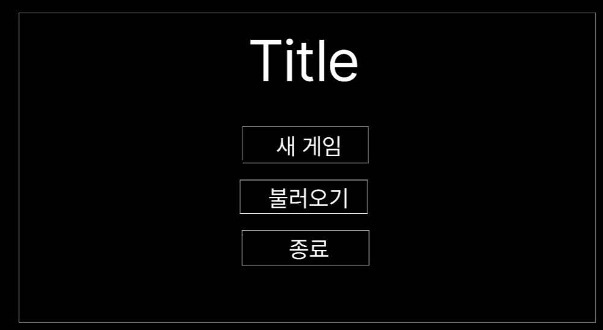
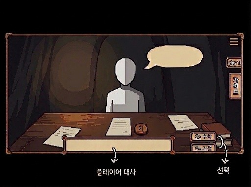
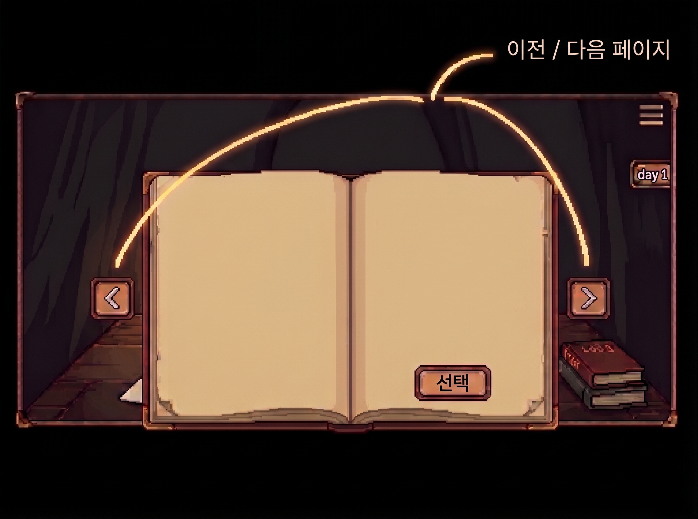

# 4. User Interface prototype

## Main menu

메인메뉴 씬이다.  
새 게임을 눌러 게임을 진행할 수 있으며, 불러오기를 통해 저장된 데이터를 불러올수있다. 종료를 통해 게임을 종료할 수 있다.

## In-game Scene

 
인게임 씬이다.  
npc와의 상호작용을 통해 의뢰를 수락하거나 거절할 수 있다. 좌측의 가이드 버튼을 통해 가이드북을 사용할 수 있다. Npc는 책상 위에 암호문과 키를 올려놓는다.

가이드북 씬이다.  
가이드북을 통해 암호해독 방법을 선택할 수 있다. 좌우에 있는 버튼을 통해 페이지를 넘길 수 있다. 해독방법을 선택하면 퍼즐 씬으로 넘어간다.
