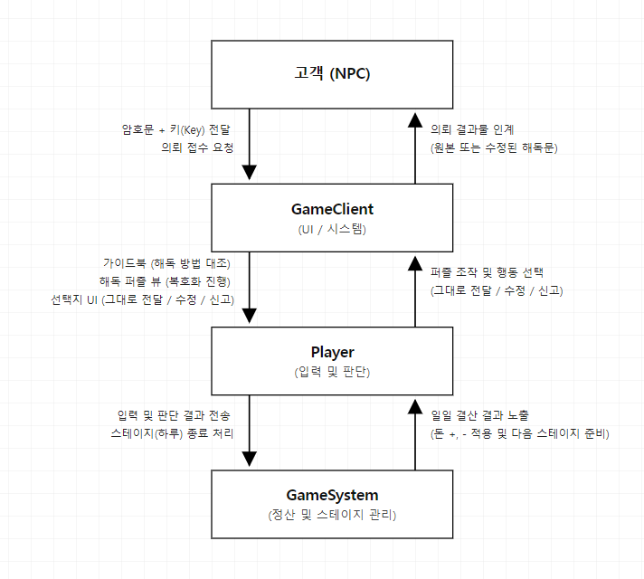

1\. Conceptualization

Project Crypto

22313552 권순표

ksp101454@gmail.com

\[ Revision history \]

  ----------------- ----------- --------------------- -------------------
  **Revision date** **Version   **Description**       **Author**
                    \#**                              

                    0.00                              

                                                      

                                                      

                                                      

                                                      

                                                      
  ----------------- ----------- --------------------- -------------------

= Contents =

1.  Business purpose
    \...\...\...\...\...\...\...\...\...\...\...\...\...\...\...\...\...\...\...\...\...\...\...\...\...\...\....

2\. System context diagram
\...\...\...\...\...\...\...\...\...\...\...\...\...\...\...\...\...\...\...\...\...\...\.....

3\. Use case list
\...\...\...\...\...\...\...\...\...\...\...\...\...\...\...\...\...\...\...\...\...\...\...\...\...\...\...\...\.....

4\. Concept of operation
\...\...\...\...\...\...\...\...\...\...\...\...\...\...\...\...\...\...\...\...\...\...\...\...\....

5\. Problem statement
\...\...\...\...\...\...\...\...\...\...\...\...\...\...\...\...\...\...\...\...\...\...\...\...\...\.....

6\. Glossary
\...\...\...\...\...\...\...\...\...\...\...\...\...\...\...\...\...\...\...\...\...\...\...\...\...\...\...\...\...\...\...\....

7\. References
\...\...\...\...\...\...\...\...\...\...\...\...\...\...\...\...\...\...\...\...\...\...\...\...\...\...\...\...\...\...\...\....

1.  Business purpose

1\) Project background

게임의 본질적인 재미는 명확한 \'목적성\'에서 비롯된다고 생각한다. \'리그
오브 레전드\', \'오버워치\', \'배틀그라운드\'와 같은 온라인 게임은
\'승리\'를, \'라스트 오브 어스\', \'젤다의 전설\'과 같은 스토리 기반
게임은 \'스토리의 엔딩\'을, \'마인크래프트\', \'돈스타브\', \'7 Days to
Die\' 등의 생존 게임은 \'생존\'이라는 크고 단순명료한 최초의 목적이
존재한다. 게임 내의 다양한 과정과 플레이 방식을 통해 부가적인 재미를
주며 최초의 목적성을 유지하도록 한다.

하지만 온라인 게임, 스토리 게임, 생존게임과 같은 게임들은 설정된 목적을
달성하기 위해 요구되는 긴 플레이 타임, 팀원과의 마찰, 상대방과의 실력
격차 등 게임 외적 요소로 인한 상당한 스트레스가 존재하게 된다. 본
프로젝트는 이러한 외적 스트레스 요소가 배제된, 단순한 플레이 방식을 가진
싱글 플레이 게임을 제작하고자 하는 목표에서 출발했다.

이러한 방향성을 모색하던 중, 과거 암호학을 배우며 암호화 및 복호화
과정의 일부가 마치 퍼즐과 같다는 느낌을 받으며 재밌었던 기억을 떠올렸다.
또한, 단순한 업무의 반복의 플레이 방식과 짧은 플레이 타임을 가졌던
\'페이퍼 플리즈(Papers, Please)\'라는 시뮬레이션 게임을 재미있게
플레이했던 기억을 떠올려 암호 해독과 결합하여 암호학을 모르더라도 누구나
가볍게 즐길 수 있는 1인 플레이 시뮬레이션 게임을 제작하고자 한다.

2\) Goal

-   짧은 플레이 타임으로 적은 피로도와 외적 스트레스 요소를 최대한
    배제한 환경을 구성한다.

-   암호학을 기반으로 하되 복잡하지 않고 가벼운 퍼즐 형태로 제작하여
    암호학을 모르더라도 쉽게 플레이할 수 있도록 한다.

3\) Target Market

-   타인과의 경쟁이나 긴 플레이 타임에 지쳐, 편하게 즐길 수 있는 1인
    플레이 인디 게임을 찾는 유저

-   \'페이퍼 플리즈(Papers, Please)\'와 같은 시뮬레이션 장르의 게임을
    선호하는 유저

-   암호 해독, 퍼즐 분야를 선호하는 유저

2\. System context diagram

{width="6.665972222222222in"
height="5.989583333333333in"}

3\. Use case list

1\) 의뢰 접수

  --------------- -------------------------------------------------------
  Actor           Player, System

  Description     하루(스테이지)가 시작되면 고객(NPC)이 방문하여 암호문과
                  키(Key) 값을 플레이어에게 전달한다.
  --------------- -------------------------------------------------------

2\) 가이드북 열람 및 페이지 검색

  --------------- -------------------------------------------------------
  Actor           Player

  Description     플레이어는 UI에 배치된 가이드북을 열어 목차를 넘기거나
                  특정 키워드를 검색하여, 현재 받은 키의 형식과 일치하는
                  해독 규칙을 찾는다.
  --------------- -------------------------------------------------------

3\) 암호 해독 (퍼즐 진행)

  --------------- -------------------------------------------------------
  Actor           Player, System

  Description     선택한 해독 방법에 맞는 해독기기(오브젝트)를 클릭하면
                  간단한 퍼즐 형식의 미니게임이 팝업된다. 플레이어는
                  퍼즐의 규칙에 따라 암호문을 평문으로 복호화한다.
  --------------- -------------------------------------------------------

4\) 의뢰인에게 결과물 전달

  --------------- -------------------------------------------------------
  Actor           Player, System

  Description     원본 그대로의 평문을 대기 중인 NPC에게 전달하고 해당
                  의뢰를 종료한다.
  --------------- -------------------------------------------------------

5\) 당국 및 적대 세력에 밀고(신고)하기

  --------------- -------------------------------------------------------
  Actor           Player, System

  Description     결과물을 NPC에게 전달하는 대신, 전화기(또는 통신 UI)를
                  상호작용하여 해당 NPC의 범죄 모의나 기밀을 경찰에게
                  신고한다.
  --------------- -------------------------------------------------------

6\) 해독 결과물 텍스트 변조

  --------------- -------------------------------------------------------
  Actor           Player, System

  Description     해독된 내용을 확인한 플레이어가 의뢰인을 속이기 위해
                  해독된 평문의 일부 단어 나열을 임의로 수정한다.
  --------------- -------------------------------------------------------

7\) 일일 정산

  --------------- -------------------------------------------------------
  Actor           System

  Description     하루(스테이지)에 할당된 고객을 모두 처리하면 영업이
                  종료되며 정산 시작한다. 올바른 해독문을 전달한 경우
                  돈이 증가하며, 수정하거나 틀린 해독문을 전달한 경우
                  돈이 감소하거나 평판 감소, 시작 시 설정된 목표 금액(빛
                  차감 등등) 등의 요소를 한번에 정산한다.
  --------------- -------------------------------------------------------

8\) 시설 업그레이드

  --------------- -------------------------------------------------------
  Actor           Player, System

  Description     일일 정산이 끝난 후, 플레이어가 번 돈을 활용해 기존에
                  존재하는 암호 형식 이외의 다른 암호방식의 해독 기기를
                  구매하여 업그레이드한다.
  --------------- -------------------------------------------------------

9\) 세이브 / 로드

  --------------- -------------------------------------------------------
  Actor           Player, System

  Description     하루(스테이지) 종료 시 자동 세이브 혹은 플레이어가 원할
                  때 데이터를 세이브한다. 해당 세이브 파일을 로드 할 수
                  있다.
  --------------- -------------------------------------------------------

10\) NPC 상호작용 및 대화 진행

  --------------- -------------------------------------------------------
  Actor           Player, System

  Description     상점에 들어온 NPC와 간단한 대화 후 암호문을 달라 혹은
                  나가라 등의 선택지 혹은 행동을 선택한다. (NPC가 암호
                  해독이 목적이 아닌 다른 이야기를 한다면 나가라, 암호
                  해독이 목적이라면 키와 암호문을 달라 등)
  --------------- -------------------------------------------------------

4\. Concept of operation

1\) 의뢰 접수

  --------------- -------------------------------------------------------
  Purpose         게임의 핵심 목표인 \'암호 해독 퀘스트\'를 플레이어에게
                  부여

  Approach        NPC가 암시장에 방문하여 플레이어의 작업대에 암호문과
                  키(Key) 아이템을 배치하는 이벤트를 발생시킨다.

  Dynamics        스테이지(하루)가 시작되고, NPC 고객이 상점 내 플레이어
                  앞까지 이동을 완료했을 경우

  Goals           플레이어가 어떤 데이터를 기반으로 퍼즐을 시작해야
                  하는지 명확한 목표와 재료를 제공한다.
  --------------- -------------------------------------------------------

2\) 가이드북 열람 및 페이지 검색

  --------------- -------------------------------------------------------
  Purpose         암호 해독의 규칙을 플레이어가 스스로 학습하고 추론

  Approach        게임 화면 내에 상시 열람 가능한 가이드북 UI를 배치하고,
                  목차 이동 및 키워드 검색 기능을 지원한다.

  Dynamics        플레이어가 전달받은 \'키(Key)\'의 형태를 확인하고, 이를
                  해독할 방법을 찾아야 할 경우

  Goals           단순한 암기가 아닌, 플레이어가 매뉴얼과 단서를 대조하여
                  논리적으로 해독법을 찾는 직관적인 추론 과정을 제공한다.
  --------------- -------------------------------------------------------

3\) 암호 해독 (퍼즐 진행)

  --------------- -------------------------------------------------------
  Purpose         게임의 메인 플레이 요소인 \'해독\' 과정을 시각적인 퍼즐
                  조작의 재미로 승화

  Approach        플레이어가 선택한 특정 해독 기기(오브젝트)와
                  상호작용하면, 해당 암호 방식에 맞는 고유의 미니게임
                  창이 팝업되게 한다.

  Dynamics        가이드북을 통해 알아낸 적절한 해독 기기를 클릭하여
                  복호화 작업을 시작할 경우

  Goals           플레이어의 규칙에 맞는 조작을 통해 의미를 알 수 없던
                  암호문을 읽을 수 있는 평문으로 변환시킨다.
  --------------- -------------------------------------------------------

4\) 의뢰인에게 결과물 전달

  --------------- -------------------------------------------------------
  Purpose         의뢰인의 본래 목적을 달성해주고 정상적인 거래 루프 완료

  Approach        복호화가 완료된 평문 텍스트를 대기 중인 NPC에게 원본
                  그대로 넘겨주는 확인(Submit) 인터페이스를 제공한다.

  Dynamics        암호 해독이 완료된 후, 플레이어가 결과물 조작이나 신고
                  없이 정상적인 인계를 선택할 경우

  Goals           퀘스트를 성공적으로 마무리지어 일일 정산 시 긍정적인
                  자금 확보의 기반을 마련한다.
  --------------- -------------------------------------------------------

5\) 당국 및 적대 세력에 밀고(신고)하기

  --------------- -------------------------------------------------------
  Purpose         플레이어에게 도덕적 딜레마를 안겨주고 팩션(세력) 간의
                  평판을 관리하는 전략적 선택지를 제공

  Approach        작업대 위의 통신 기기(전화기 등) 상호작용을 통해,
                  의뢰인 대신 경찰이나 적대 세력에게 결과물 내용을 넘기는
                  기능을 구현한다.

  Dynamics        해독된 내용이 범죄 모의나 기밀과 연관되어 있고,
                  플레이어가 이를 의뢰인에게 주지 않고 신고하기로
                  결정했을 경우

  Goals           단순한 퍼즐 클리어를 넘어 게임 세계관 스토리에 직접
                  개입하게 만들고, 자금과 평판이라는 두 자원 사이의
                  갈등을 유발한다.
  --------------- -------------------------------------------------------

6\) 해독 결과물 텍스트 변조

  --------------- -------------------------------------------------------
  Purpose         의뢰인을 기만하거나 플레이어 본인의 생존/이득을 위한
                  악의적 플레이를 지원

  Approach        해독 완료된 평문에서 특정 단어나 문장을 클릭하여
                  플레이어가 임의의 거짓 정보로 바꿀 수 있는 텍스트
                  에디팅 UI를 제공한다.

  Dynamics        플레이어가 해독된 평문 내용을 확인한 후, 진실을 숨기기
                  위해 결과물 변조 조작을 시도할 경우

  Goals           거짓된 정보 전달로 인한 리스크(발각 시 평판 하락, 돈
                  감소 등)와 숨겨진 리턴을 제공하여 행동 선택 시의
                  신중함을 요구한다.
  --------------- -------------------------------------------------------

7\) 일일 정산

  --------------- -------------------------------------------------------
  Purpose         하루(스테이지) 동안의 플레이어 성과를 종합하여 명확한
                  피드백과 보상을 제공

  Approach        하루 영업 종료 시, 정확도에 따른 수입/지출 계산, 시작
                  시 설정된 목표 금액(빚 차감 등), 평판 변화 수치를 일괄
                  계산하여 결산 화면에 출력한다.

  Dynamics        스테이지에 할당된 모든 NPC 고객의 의뢰 처리가 완전히
                  종료 경우

  Goals           플레이어의 현재 경제적/사회적(평판) 상황을 가시화하고,
                  게임 오버 조건(이자 미납 등)을 관리하며 다음 스테이지에
                  대한 동기를 부여한다.
  --------------- -------------------------------------------------------

8\) 시설 업그레이드

  --------------- -------------------------------------------------------
  Purpose         플레이어의 노력에 대한 성취감을 제공하고, 게임 진행에
                  따라 해독 가능한 암호의 종류를 점진적으로 확장

  Approach        정산 완료 후 상점 UI를 출력하여, 획득한 자금을 소모해
                  새로운 방식의 암호 해독 기기를 구매하거나 기존 시설을
                  강화할 수 있게 한다.

  Dynamics        일일 정산이 끝나고, 다음 스테이지(하루)가 시작되기 전의
                  정비 시간일 경우

  Goals           플레이어의 자금 소비처를 제공하고 게임의 퍼즐 볼륨과
                  난이도를 자연스럽게 끌어올린다.
  --------------- -------------------------------------------------------

9\) 세이브 / 로드

  --------------- -------------------------------------------------------
  Purpose         플레이어의 게임 진행 상황을 안전하게 보존하고, 원할 때
                  특정 분기점이나 날짜로 되돌아갈 수 있는 편의성을 제공

  Approach        하루(스테이지) 종료 시 시스템이 자동으로 데이터를
                  직렬화하여 저장하며, 일시정지 메뉴를 통해 플레이어의
                  수동 저장 및 불러오기를 지원한다.

  Dynamics        스테이지 정산이 끝난 직후(자동) 또는 플레이어가 시스템
                  메뉴에서 세이브/로드를 요청했을 경우(수동).

  Goals           데이터 손실을 방지하고, 플레이어가 여러 가지
                  선택지(밀고, 변조 등)의 결과를 부담 없이 실험해 볼 수
                  있는 환경을 조성한다.
  --------------- -------------------------------------------------------

10\) NPC 상호작용 및 대화 진행

  --------------- -------------------------------------------------------
  Purpose         텍스트를 통해 불필요한 고객을 걸러내는 퍼즐 이외의
                  요소를 플레이어에게 제공

  Approach        NPC 방문 시 대화창 시스템을 활성화하여, 대화 내용의
                  문맥을 파악한 뒤 \'키와 암호문을 달라(수락)\' 혹은
                  \'나가라(거절)\' 등의 행동 선택지를 제공한다.

  Dynamics        NPC가 상점에 입장하여 플레이어와 상호작용을 시작할 경우

  Goals           단순히 방문하는 모든 NPC의 암호문을 해독하기만 하는
                  것이 아닌 퍼즐 이외의 작은 요소를 플레이어에게
                  제공한다.
  --------------- -------------------------------------------------------

5\. Problem statement

1\) Problem #1:　암호문 / 평문 관리

문제점: 최소 수십개의 평문이 존재해야 하고 평문에 맞는 암호문이 존재해야
하는데 이를 모두 단순히 리스트로 관리한다면 구현은 쉬워지지만 하나의
평문을 추가할 때마다 직접 암호화를 진행해야 하기 때문에 제작도 오래
걸리고 유지 보수 측면에서도 좋지 않다.

해결방안: 너무 복잡한 복호화 / 암호화 알고리즘은 게임의 성능 하락으로
이어질 수 있으니 적당한 선의 암호화 방식을 추려내어 평문만 텍스트로
관리하고 암호문은 코드를 통해 제작 / 관리하도록 설계

평문 -\> 암호화 -\> 암호문 제공 (인게임)-\> 복호화 -\> 평문 제공(인게임)
순으로 제작할지 평문 -\> 암호화 -\> 암호화에 사용된 평문 -\> 평문 제공
(인게임) 으로 제작할지는 추후 선택

2\) Problem #2: 퍼즐 난이도 밸런싱 및 반복성

문제점: 퍼즐을 풀어서 평문을 알아내는 방식이기 때문에 너무 복잡한 암호화
방식을 채택하거나 평문의 길이가 길다면 UI가 난잡해져 가독성이 떨어지고
퍼즐 풀이 시간이 길어져 플레이어가 피로감를 느끼거나 게임의 진행이 너무
루즈해질수 있다.

해결방안: 난수 생성, 해시 값, 애니그마 등의 방식은 배제하고 시저암호,
단순 치환, 카이사르 암호 등 퍼즐의 변경이 적합한 방식을 채택하여
제작하거나 평문의 일부 단어만 구하고 옳게 구했다면 여러 개의 평문 중
하나를 고르는 방식 혹은 평문의 글자 수만큼 진행하는 것이 아닌 일정
횟수만 진행하면 평문이 나오도록 제작

NFRS (비기능적 요구사항)

a\. 게임 엔진은 Unity를 사용하여 2D 환경으로 제작한다.

b\. 연산이 복잡한 알고리즘은 배제하고 경량화가 가능한 알고리즘 위주로
설계한다.

c\. 텍스트와 이미지의 가독성을 보장하는 UI/UX를 구성한다.

d\. 암호문과 평문은 최소 10자, 최대 25자로 제작하여 플레이 상의 과도한
반복 작업을 지양한다.

6\. Glossary

  --------------- -------------------------------------------------------
  용어            설명

  Unity           게임 클라이언트를 제작하기위한 기본 도구

  Object          인 게임에서 플레이어와 상호작용하는 개체
  --------------- -------------------------------------------------------

7\. References

1\. Unity Documentation : [https://docs.unity.com/]{.underline}

2\. Unity Asset
Store　:　[https://assetstore.unity.com/ko-KR]{.underline}　

3\. 시뮬레이션 게임 \'Papers, Please\' 참고
