# 2. Class diagram

해당 프로젝트는 Unity를 사용하여 2D 환경의 암호 해독 시뮬레이션 게임으로 제작한다. 본 프로젝트는 플레이어가 NPC로부터 암호문과 키를 전달받고, 가이드북과 해독 기기를 이용하여 암호를 해독한 뒤 결과를 제출하거나 변조, 신고하는 흐름을 중심으로 구성된다. 따라서 클래스 구조 역시 플레이어 조작, NPC 의뢰 처리, 암호 처리, 퍼즐 UI, 정산 및 저장 시스템을 중심으로 설계하였다.

해당 클래스 다이어그램은 Project Crypto의 주요 게임 진행 흐름에 사용되는 핵심 클래스들을 표현한 다이어그램이다. 실제 구현 과정에서는 UI 버튼, 팝업창, 세부 암호 기기, 애니메이션 처리 등 더 많은 보조 클래스가 사용될 수 있으나, 본 클래스 다이어그램에서는 게임의 주요 기능을 담당하는 핵심 클래스 위주로 표현하였다.

Unity 프로젝트의 특성상 대부분의 클래스는 MonoBehaviour를 상속받아 게임 오브젝트에 컴포넌트 형태로 부착된다. MonoBehaviour는 Unity 스크립트가 기본적으로 상속받는 클래스로, Start(), Update(), 충돌 처리, 트리거 감지, 코루틴 실행 등 게임 오브젝트의 동작을 제어하는 기능을 제공한다. 본 프로젝트에서도 각 오브젝트의 역할을 독립적인 컴포넌트로 나누어 관리하며, 이를 통해 기능별 수정과 확장이 쉽도록 설계하였다.

본 프로젝트의 클래스는 크게 게임 흐름 관리, 플레이어 및 NPC 상호작용, 암호 처리 및 해독 기기, 정산 및 성장 시스템으로 구분할 수 있다.

```mermaid
classDiagram

class GameManager {
- int currentDay
- float stageTime
- bool isGameOver
+ StartGame()
+ StartStage()
+ SpawnNPC()
+ EndStage()
+ CheckGameOver()
+ CallSettlement()
+ SaveGame()
+ PlaceOwnedDevices()
}

class SaveManager {
- SaveData saveData
+ SaveFromPlayer()
+ LoadToPlayer()
+ CreateNewSave()
+ AddOwnedDevice()
+ GetOwnedDevices()
}

class SaveData {
- int day
- int money
- int reputation
- string ownedDevices
+ Serialize()
+ Deserialize()
}

class PlayerController {
- int money
- int reputation
- GameObject selectedObject
+ GetMoney()
+ AddMoney()
+ SpendMoney()
+ GetReputation()
+ AddReputation()
+ ClickObject()
+ InteractNPC()
+ OpenGuidebook()
+ SelectDevice()
+ SubmitResult()
}

class NPCController {
- RequestData currentRequest
- bool hasRequest
+ EnterShop()
+ StartDialogue()
+ GiveRequest()
+ ReceiveResult()
+ ReactToChoice()
+ ExitShop()
}

class RequestData {
- string ciphertext
- string plainText
- string key
- CipherType cipherType
- int reward
- int riskLevel
- bool canReport
+ GetCipherText()
+ GetKey()
+ GetAnswer()
}

class WorktableManager {
- GameObject cipherPaper
- GameObject keyObject
- GameObject guidebook
- GameObject reportDevice
+ PlaceRequest()
+ PlaceDevices()
+ ActivateObject()
+ ClearWorktable()
+ OpenGuidebook()
+ OpenDevice()
}

class CipherEngine {
+ Encrypt()
+ Decrypt()
+ ValidateAnswer()
}

class GuidebookManager {
- int currentPage
- CipherType selectedCipherType
+ OpenGuidebook()
+ CloseGuidebook()
+ NextPage()
+ PrevPage()
+ SelectCipherMethod()
}

class DecryptionDevice {
<>
- RequestData requestData
- string inputText
- string resultText
+ OpenPuzzle()
+ SetRequestData()
+ ApplyInput()
+ CheckResult()
+ ClosePuzzle()
}

class CaesarDevice {
- int shiftValue
+ RotateDial()
+ ConvertText()
+ CheckResult()
}

class SubstitutionDevice {
- Dictionary_char_char substitutionMap
+ SetMapping()
+ ConvertText()
+ CheckResult()
}

class ResultManager {
- string resultText
- bool isCompleted
- bool isModified
- bool isReported
+ CreateResult()
+ MarkCompleted()
+ CheckResult()
+ GetFinalResult()
+ RequestModulation()
+ RequestReport()
}

class ModulationManager {
- string originalText
- string modifiedText
+ OpenModulationUI()
+ ModifyText()
+ ApplyModifiedText()
+ SetModulationState()
}

class ReportManager {
- bool reportSuccess
+ OpenReportUI()
+ CheckReportable()
+ SendReport()
+ ApplyReportResult()
}

class SettlementSystem {
- int successCount
- int failCount
- int modulationCount
- int reportCount
- int rewardDelta
- int reputationDelta
+ CalculateReward()
+ CalculatePenalty()
+ CalculateReputation()
+ ApplyToPlayer()
+ ShowSettlement()
}

class ShopManager {
- string purchasableDevices
- string ownedDevices
+ OpenShop()
+ BuyDevice()
+ UpgradeFacility()
+ CheckMoney()
+ RequestAddOwnedDevice()
}

class CipherType {
<>
Caesar
Substitution
Playfair
Vigenere
}

GameManager --> NPCController : controls spawn
GameManager --> SettlementSystem : calls settlement
GameManager --> SaveManager : saves or loads
GameManager --> WorktableManager : places owned devices

SaveManager --> SaveData : stores snapshot
SaveManager --> PlayerController : syncs player data

PlayerController --> NPCController : interacts
PlayerController --> WorktableManager : clicks objects
PlayerController --> GuidebookManager : opens guidebook
PlayerController --> ResultManager : checks result
PlayerController --> NPCController : delivers result

NPCController --> RequestData : creates request

RequestData --> CipherType : has type
RequestData --> WorktableManager : used for placement

WorktableManager --> RequestData : places request objects
WorktableManager --> GuidebookManager : opens guidebook
WorktableManager --> DecryptionDevice : manages devices

GuidebookManager --> CipherType : selects method
GuidebookManager --> DecryptionDevice : opens matched device

DecryptionDevice --> RequestData : uses request data
DecryptionDevice --> CipherEngine : sends input

DecryptionDevice <|-- CaesarDevice
DecryptionDevice <|-- SubstitutionDevice

CaesarDevice --> CipherEngine : checks caesar result
SubstitutionDevice --> CipherEngine : checks substitution result

ResultManager --> CipherEngine : validates result
ResultManager --> ModulationManager : requests modulation
ResultManager --> ReportManager : requests report

SettlementSystem --> ResultManager : reads result records
SettlementSystem --> PlayerController : applies money and reputation
SettlementSystem --> ShopManager : enables upgrade phase

ShopManager --> PlayerController : checks and spends money
ShopManager --> SaveManager : updates owned devices
ShopManager --> DecryptionDevice : unlocks devices
```

## Game System
| 클래스명   | 주요 역할  | 주요 기능 |
| :------------------- | :---------------------------- | :------------------------------------------------- |
| **GameManager**        | 게임의 전체 흐름을 관리하는 최상위 클래스       | 스테이지 시작, NPC 생성, 영업 시간 관리, 하루 종료, 게임 오버 및 엔딩 조건 관리 |
| **SaveManager**        | 게임 진행 상황 저장 및 불러오기 담당         | 자금, 평판, 날짜, 보유 기기, 진행 상태 저장 및 |

## Player / NPC
| 클래스명   | 주요 역할  | 주요 기능 |
| :------------------- | :---------------------------- | :------------------------------------------------- |
| **PlayerController**     | 플레이어의 입력과 행동을 관리              | 마우스 클릭, UI 선택, 오브젝트 상호작용, 자금 및 평판 정보 관리            |
| **NPCController**     | 게임 진행 상황 저장 및 불러오기 담당         | 자금, 평판, 날짜, 보유 기기, 진행 상태 저장 및 |
## Request / Worktable
| 클래스명   | 주요 역할  | 주요 기능 |
| :------------------- | :---------------------------- | :------------------------------------------------- |
| **RequestData**        | NPC가 전달하는 의뢰 정보를 저장하는 데이터 클래스 | 암호문, 원본 평문, 키 값, 암호 방식, 보상, 위험도, 신고 가능 여부 저장       |
| **WorktableManager**        |  작업대 위 오브젝트의 배치와 상호작용 관리       | 암호문 서류, 키 아이템, 가이드북, 해독 기기, 전화기 활성화 및 제어           |
## Cipher / Decryption
| 클래스명   | 주요 역할  | 주요 기능 |
| :------------------- | :---------------------------- | :------------------------------------------------- |
| **CipherEngine**        | 암호화 및 복호화 검증을 담당하는 핵심 클래스     | 평문을 암호문으로 변환, 플레이어 입력값과 정답 비교, 해독 결과 검증            |
| **GuidebookManager**        | 암호 해독 규칙을 확인하는 가이드북 UI 관리     | 페이지 넘김, 목차 이동, 암호 방식 선택, 해독 기기 연결    |
| **DecryptionDevice**| 해독 기기들의 부모 클래스       | 퍼즐 UI 열기, 키 값 설정, 입력값 반영, 결과 확인 요청   |
| **CaesarDevice** |시저 암호 방식의 해독 기기 클래스           | 키 값에 따른 문자 이동, 암호문을 평문 후보로 변환       |
| **SubstitutionDevice** |단순 치환 암호 방식의 해독 기기 클래스        | 암호 문자와 평문 문자의 대응 관계 설정, 치환 결과 생성         |
## Result / Choice
| 클래스명   | 주요 역할  | 주요 기능 |
| :------------------- | :---------------------------- | :------------------------------------------------- |
| **ResultManager**        | 독 완료 후 생성된 평문 문서 관리          | 평문 생성, 제출 가능 상태 변경, 변조 여부 표시, 신고 가능 여부 확인          |
| **ModulationManager**        | 해독된 평문 변조 기능 관리    | 평문 일부 수정, 거짓 문장 교체, 변조 상태 기록     |
| **ReportManager** |  해독 결과 신고 기능 관리           | 전화기 또는 신고 UI를 통한 신고 처리, 보상 및 평판 변화 반영         |
## Settlement / Upgrade
| 클래스명   | 주요 역할  | 주요 기능 |
| :------------------- | :---------------------------- | :------------------------------------------------- |
| **SettlementSystem**  | 하루 종료 시 성과 정산 담당   | 해독 건수, 오답, 변조, 신고 보상, 세금, 이자 계산     |

