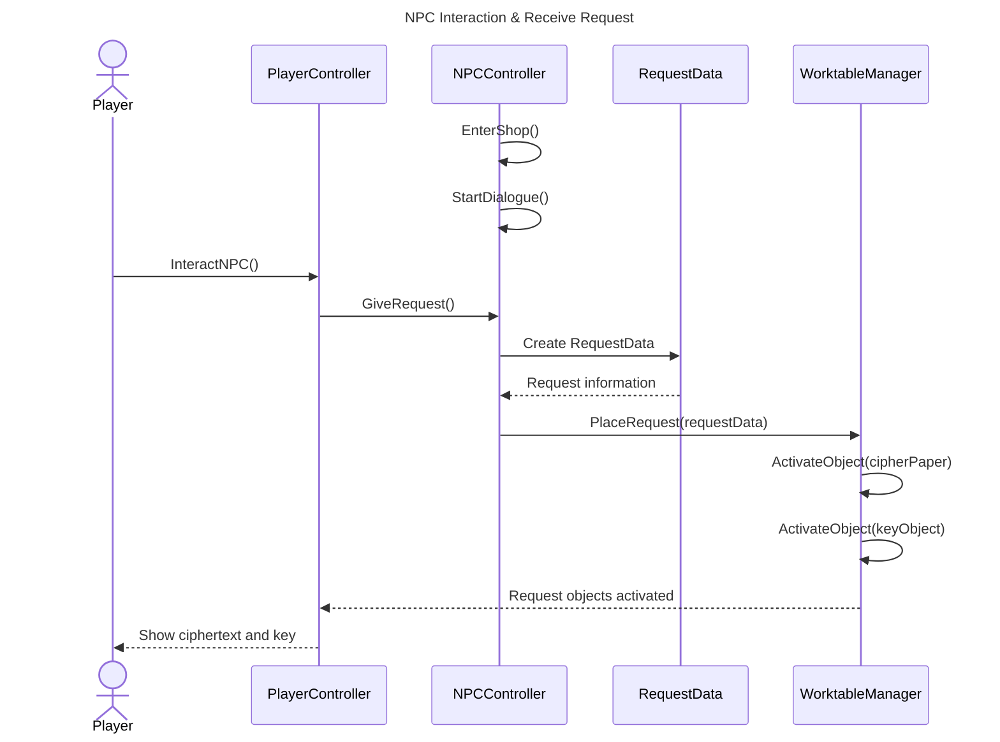
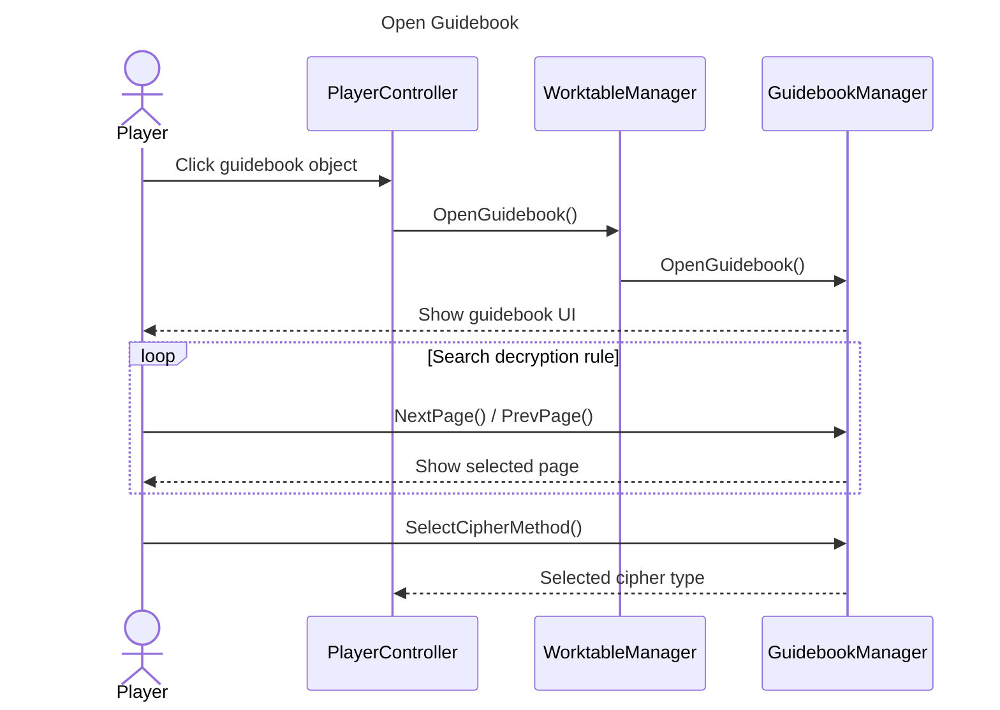
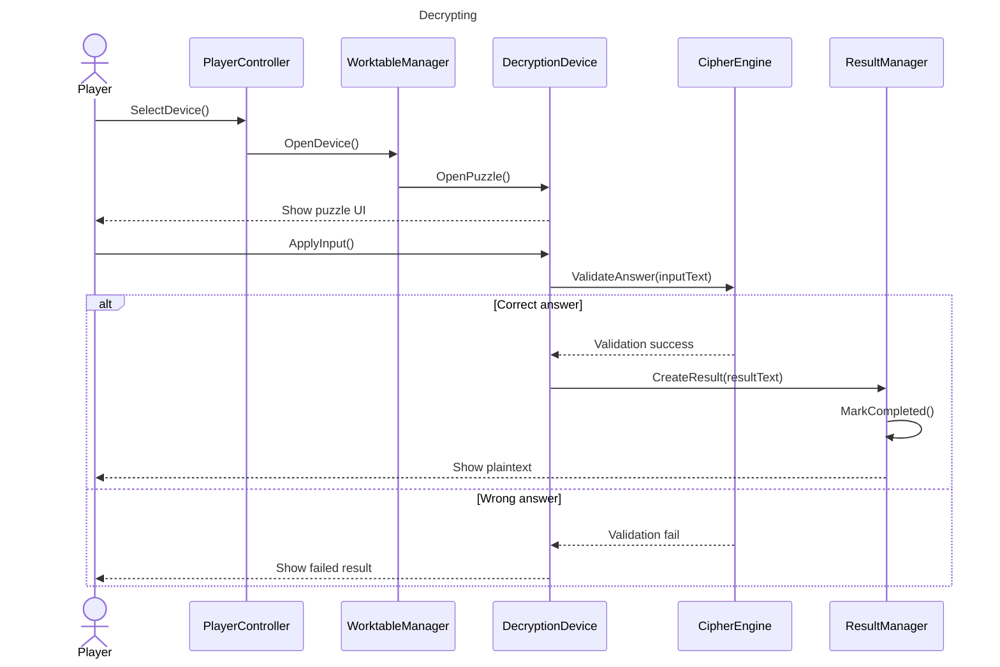
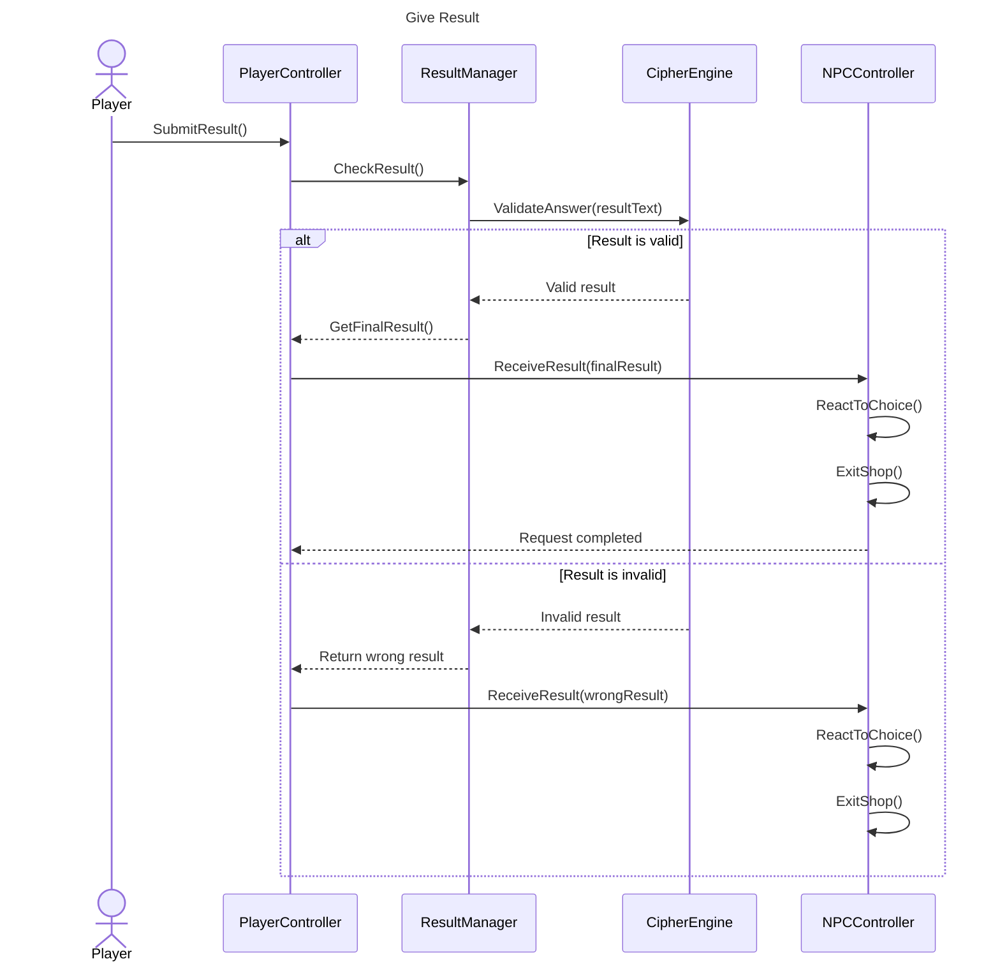
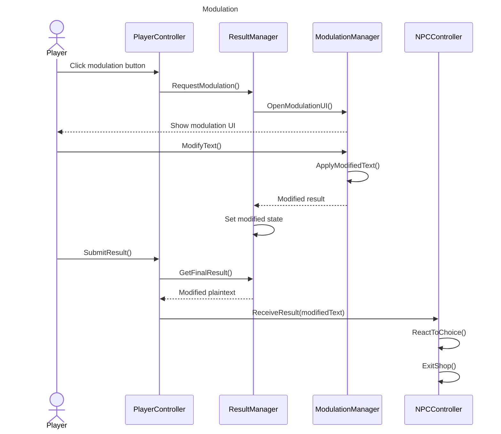
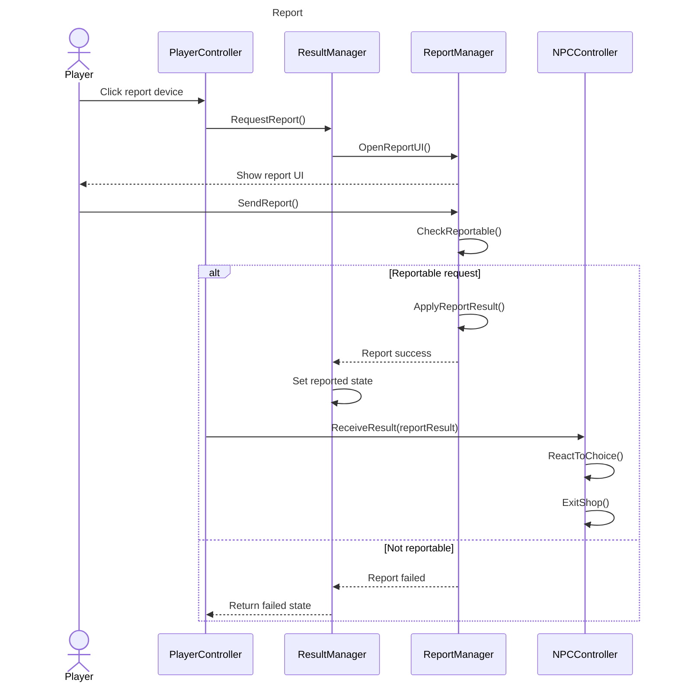
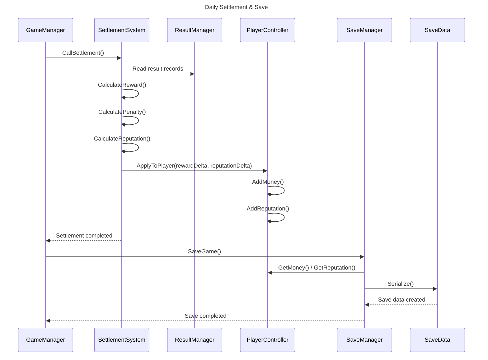
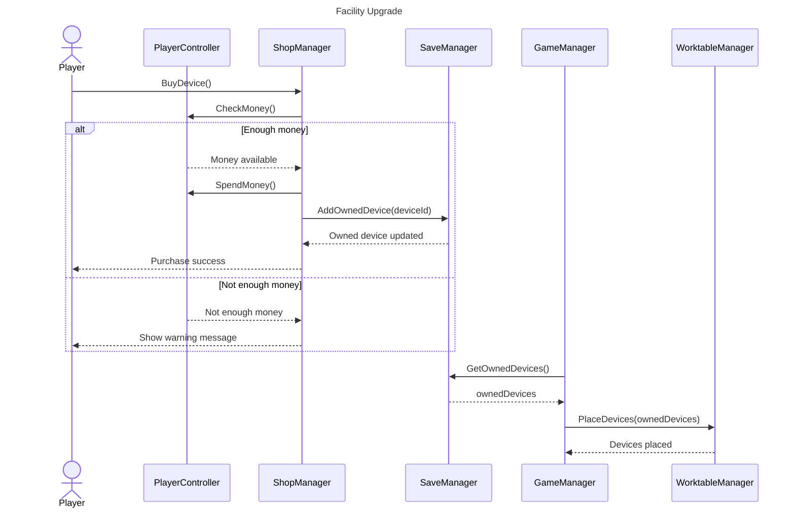

# 3. Sequence diagram

본 장에서는 Project Crypto의 주요 Use Case가 실제 시스템 내부에서 어떤 순서로 동작하는지 Sequence Diagram으로 표현한다.
Sequence Diagram은 객체 간의 메시지 전달 순서를 시간 흐름에 따라 보여주는 다이어그램이다.

본 프로젝트의 핵심 흐름은 다음과 같다.

```text
NPC 상호작용
→ 의뢰 접수
→ 가이드북 확인
→ 해독 기기 조작
→ 해독 결과 생성
→ 평문 제출 / 변조 / 신고
→ 일일 정산
→ 시설 업그레이드 및 저장
```

따라서 본 Sequence Diagram에서는 게임의 주요 반복 루프에 해당하는 Use Case를 중심으로 작성한다.

---

### 3.1 NPC Interaction & Receive Request

NPC가 상점에 입장하고, 플레이어가 NPC와 상호작용하여 의뢰를 수락하는 흐름이다.
NPC는 암호문과 키 값을 포함한 `RequestData`를 생성하고, `WorktableManager`는 해당 의뢰 정보를 바탕으로 작업대 위에 암호문 서류와 키 오브젝트를 배치한다.



NPC Interaction & Receive Request Use Case에서 플레이어는 NPC와 대화하고, 의뢰를 수락하면 암호문과 키를 전달받는다. 이후 작업대 위의 암호문 서류와 키 아이템이 활성화되어 플레이어가 확인할 수 있는 상태가 된다.

---

### 3.2 Open Guidebook

플레이어가 전달받은 암호문과 키를 확인한 뒤, 가이드북을 열어 해독 방법을 찾는 흐름이다.
`PlayerController`는 플레이어의 클릭 입력을 받아 `GuidebookManager`에 가이드북 UI 열기를 요청한다. 플레이어는 페이지를 넘기며 암호 해독 규칙을 확인하고, 적절한 암호 방식을 선택한다.



Open Guidebook Use Case는 플레이어가 암호 해독 규칙을 직접 확인하는 과정이다.
가이드북은 해독 방법을 설명하는 UI이며, 플레이어는 전달받은 키의 형태와 암호문을 비교하여 어떤 해독 기기를 사용할지 결정한다.

---

### 3.3 Decrypting

플레이어가 가이드북을 통해 해독 방식을 선택한 뒤, 작업대 위의 해독 기기를 조작하여 암호문을 평문으로 변환하는 흐름이다.
`DecryptionDevice`는 개별 해독 기기들의 부모 클래스이며, 시저 암호의 경우 `CaesarDevice`, 치환 암호의 경우 `SubstitutionDevice`와 같은 하위 클래스가 실제 조작 방식을 담당한다.



Decrypting Use Case는 Project Crypto의 핵심 퍼즐 흐름이다.
플레이어가 해독 기기를 조작하면 입력값이 `CipherEngine`으로 전달되고, `CipherEngine`은 해당 입력이 올바른 평문인지 검증한다. 올바른 결과가 나오면 `ResultManager`가 평문 문서를 생성한다.

---

### 3.4 Give Result

플레이어가 해독된 평문을 NPC에게 제출하는 흐름이다.
수정된 클래스 구조에서는 `ResultManager`가 직접 `NPCController`를 호출하지 않고, `PlayerController`가 중재자 역할을 수행한다. 이를 통해 `ResultManager`와 `NPCController` 간의 순환 참조를 방지한다.



Give Result Use Case는 해독 결과를 NPC에게 전달하여 의뢰를 종료하는 흐름이다.
정상적인 평문을 제출하면 의뢰 성공으로 기록되고, 미완성 또는 오답을 제출하면 실패 처리되어 이후 일일 정산에서 페널티가 적용될 수 있다.

---

### 3.5 Modulation

플레이어가 해독된 평문의 일부 내용을 변조한 뒤 NPC에게 제출하는 흐름이다.
변조는 결과 제출 과정에서 선택적으로 발생하는 확장 기능이며, 변조 여부는 `ResultManager`에 기록되어 일일 정산에 반영된다.



Modulation Use Case는 플레이어가 의도적으로 평문 내용을 바꾸는 선택지이다.
변조된 결과물은 NPC에게 전달될 수 있지만, 이후 발각 여부나 게임 규칙에 따라 보상 또는 페널티가 발생할 수 있다.

---

### 3.6 Report

플레이어가 평문을 NPC에게 전달하지 않고 신고하는 흐름이다.
신고 기능은 결과 제출 대신 선택 가능한 행동이며, `ReportManager`는 신고 가능 여부를 확인하고 신고 결과를 처리한다.



Report Use Case는 해독 결과를 이용해 NPC를 신고하는 선택지이다.
신고가 가능한 의뢰라면 보상이나 평판 변화가 발생할 수 있으며, 신고 대상이 아닌 경우에는 실패 상태가 기록된다.

---

### 3.7 Daily Settlement & Save

하루가 종료되었을 때 플레이어의 의뢰 처리 결과를 정산하고, 현재 게임 상태를 저장하는 흐름이다.
`SettlementSystem`은 `ResultManager`에 기록된 결과를 확인하여 보상, 페널티, 평판 변화를 계산한다. 이후 `PlayerController`의 자산 데이터에 결과를 반영하고, `SaveManager`는 해당 데이터를 저장용 `SaveData`로 변환한다.



Daily Settlement & Save Use Case는 하루 단위 게임 루프를 마무리하는 과정이다.
정산 결과는 플레이어의 자금과 평판에 반영되며, 저장 시스템은 플레이어의 현재 상태를 `SaveData` 형태로 저장한다.

---

### 3.8 Facility Upgrade

일일 정산 이후 플레이어가 획득한 자금을 사용하여 새로운 해독 기기를 구매하거나 시설을 업그레이드하는 흐름이다.
구매가 성공하면 `ShopManager`는 `SaveManager`에 보유 기기 목록 갱신을 요청하고, 다음 스테이지 시작 시 `GameManager`가 `WorktableManager`를 통해 작업대에 보유 기기를 배치한다.



Facility Upgrade Use Case는 플레이어의 성장 요소를 담당한다.
정산 후 획득한 자금을 사용해 새로운 해독 기기를 구매할 수 있으며, 구매한 기기는 저장 데이터에 기록된 뒤 다음 스테이지의 작업대에 배치된다.

---

### 3.9 Sequence Diagram Summary

|  번호 | Sequence Diagram                  | 설명                                       |
| :-: | :-------------------------------- | :--------------------------------------- |
| 3.1 | NPC Interaction & Receive Request | NPC가 등장하고 플레이어가 의뢰를 수락하여 암호문과 키를 전달받는 흐름 |
| 3.2 | Open Guidebook                    | 플레이어가 가이드북을 열어 암호 해독 규칙을 확인하는 흐름         |
| 3.3 | Decrypting                        | 해독 기기를 조작하여 암호문을 평문으로 변환하는 흐름            |
| 3.4 | Give Result                       | 해독 결과를 NPC에게 제출하는 흐름                     |
| 3.5 | Modulation                        | 평문을 변조한 뒤 제출하는 흐름                        |
| 3.6 | Report                            | 평문을 NPC에게 주지 않고 신고하는 흐름                  |
| 3.7 | Daily Settlement & Save           | 하루 결과를 정산하고 저장하는 흐름                      |
| 3.8 | Facility Upgrade                  | 정산 후 자금으로 해독 기기를 구매하고 작업대에 반영하는 흐름       |
