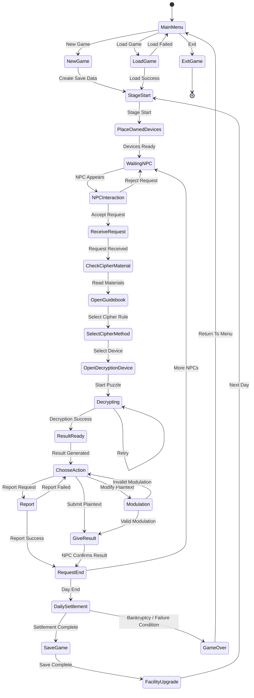

## 4. State Machine Diagram

본 장에서는 Project Crypto의 전체 게임 진행 상태를 State Machine Diagram으로 표현한다.
State Machine Diagram은 게임이 실행된 이후 어떤 상태를 거치며 진행되는지, 그리고 각 상태가 어떤 조건에 의해 다음 상태로 전환되는지를 나타내는 다이어그램이다.

Project Crypto는 하루 단위의 스테이지를 반복하는 구조를 가진다. 플레이어는 NPC와 상호작용하여 의뢰를 수락하고, 암호문과 키를 확인한 뒤 가이드북과 해독 기기를 이용해 평문을 도출한다. 이후 결과물을 NPC에게 전달하거나, 평문을 변조하거나, 신고하는 선택을 할 수 있다. 하루가 종료되면 일일 정산이 진행되고, 정산 결과에 따라 다음 스테이지로 이동하거나 게임 오버 상태로 전환된다.

---

### 4.1 State Machine Diagram Code

---

### 4.2 State Description

| 상태                   | 설명                                           |
| -------------------- | -------------------------------------------- |
| MainMenu             | 게임 시작 시 진입하는 상태이다. 새 게임, 불러오기, 종료를 선택할 수 있다. |
| NewGame              | 새로운 저장 데이터를 생성하고 게임을 시작하는 상태이다.              |
| LoadGame             | 기존 저장 데이터를 불러오는 상태이다.                        |
| StageStart           | 새로운 하루가 시작되는 상태이다.                           |
| PlaceOwnedDevices    | 플레이어가 보유한 해독 기기를 작업대에 배치하는 상태이다.             |
| WaitingNPC           | NPC가 등장하기 전 대기 상태이다.                         |
| NPCInteraction       | NPC와 대화하여 의뢰를 수락하거나 거절하는 상태이다.               |
| ReceiveRequest       | NPC로부터 암호문과 키를 전달받는 상태이다.                    |
| CheckCipherMaterial  | 암호문과 키를 확인하는 상태이다.                           |
| OpenGuidebook        | 가이드북을 열어 암호 해독 방법을 확인하는 상태이다.                |
| SelectCipherMethod   | 사용할 암호 해독 방식을 선택하는 상태이다.                     |
| OpenDecryptionDevice | 선택한 암호 방식에 맞는 해독 기기를 활성화하는 상태이다.             |
| Decrypting           | 해독 퍼즐을 진행하는 상태이다.                            |
| ResultReady          | 평문 생성이 완료된 상태이다.                             |
| ChooseAction         | 결과 제출, 변조, 신고 중 하나를 선택하는 상태이다.               |
| GiveResult           | 평문 또는 변조된 평문을 NPC에게 제출하는 상태이다.               |
| Modulation           | 평문을 수정하는 상태이다.                               |
| Report               | 의뢰를 신고하는 상태이다.                               |
| RequestEnd           | 하나의 의뢰 처리가 완료된 상태이다.                         |
| DailySettlement      | 하루 동안 처리한 의뢰 결과를 정산하는 상태이다.                  |
| SaveGame             | 현재 진행 상황을 저장하는 상태이다.                         |
| FacilityUpgrade      | 해독 기기를 구매하거나 시설을 업그레이드하는 상태이다.               |
| GameOver             | 파산 또는 실패 조건에 의해 게임이 종료된 상태이다.                |
| ExitGame             | 게임을 종료하는 상태이다.                               |

---

### 4.3 State Flow Summary

| 단계 | 상태 흐름                                                  | 설명                                 |
| -- | ------------------------------------------------------ | ---------------------------------- |
| 1  | MainMenu → NewGame / LoadGame                          | 플레이어가 새 게임을 시작하거나 저장 데이터를 불러온다.    |
| 2  | StageStart → PlaceOwnedDevices → WaitingNPC            | 새로운 하루가 시작되고 보유한 해독 기기가 작업대에 배치된다. |
| 3  | NPCInteraction → ReceiveRequest                        | NPC와 상호작용하여 의뢰를 수락한다.              |
| 4  | ReceiveRequest → CheckCipherMaterial → OpenGuidebook   | 암호문과 키를 확인하고 가이드북을 통해 해독 방법을 찾는다.  |
| 5  | SelectCipherMethod → OpenDecryptionDevice → Decrypting | 적절한 해독 기기를 선택하고 퍼즐을 진행한다.          |
| 6  | ResultReady → ChooseAction                             | 평문 생성이 완료되어 행동을 선택할 수 있다.          |
| 7  | GiveResult / Modulation / Report                       | 결과 제출, 변조, 신고 중 하나를 수행한다.          |
| 8  | RequestEnd → WaitingNPC                                | 남은 NPC가 존재하면 다음 의뢰를 처리한다.          |
| 9  | RequestEnd → DailySettlement                           | 하루가 종료되면 일일 정산을 진행한다.              |
| 10 | DailySettlement → SaveGame                             | 정산 결과를 적용하고 게임을 저장한다.              |
| 11 | SaveGame → FacilityUpgrade                             | 시설 업그레이드 또는 신규 해독 기기 구매를 진행한다.     |
| 12 | FacilityUpgrade → StageStart                           | 다음 날 스테이지를 시작한다.                   |
| 13 | DailySettlement → GameOver                             | 파산 또는 실패 조건을 만족하면 게임 오버가 된다.       |

---

### 4.4 Description

Project Crypto의 상태 머신은 하루 단위의 반복적인 게임 루프를 기반으로 설계되었다.

게임이 시작되면 플레이어는 메인 메뉴에서 새 게임을 시작하거나 저장된 데이터를 불러온다. 스테이지가 시작되면 현재 보유한 해독 기기가 작업대에 자동으로 배치되고 NPC의 방문을 기다린다.

NPC가 등장하면 플레이어는 의뢰를 수락하거나 거절할 수 있다. 의뢰를 수락한 경우 암호문과 키가 작업대에 배치되며, 플레이어는 이를 분석하기 위해 가이드북을 열어 적절한 해독 방식을 확인한다. 이후 해독 기기를 선택하여 퍼즐을 진행하며, 성공적으로 해독하면 평문이 생성된다.

평문이 생성되면 플레이어는 결과를 NPC에게 제출하거나, 내용을 변조하거나, 의뢰를 신고할 수 있다. 변조는 시스템이 허용하는 범위 내에서만 성공하며, 실패할 경우 다시 행동을 선택해야 한다. 신고 역시 신고 가능한 의뢰에 대해서만 성공하며, 실패 시 플레이어는 다른 행동을 선택할 수 있다.

하나의 의뢰가 종료되면 다음 NPC를 처리하거나, 하루가 종료되었을 경우 일일 정산 단계로 이동한다. 정산 단계에서는 성공한 의뢰 수, 실패한 의뢰 수, 변조 및 신고 결과 등을 바탕으로 보상과 평판 변화를 계산한다. 이후 게임을 저장하고 시설 업그레이드를 진행한다.

플레이어는 업그레이드 단계에서 새로운 해독 기기를 구매하거나 기존 시설을 강화할 수 있으며, 업그레이드가 완료되면 다음 날 스테이지가 시작된다. 만약 정산 결과가 파산 상태에 도달하거나 게임 실패 조건을 만족하면 게임은 GameOver 상태로 전환된다.
